# 実現したいこと

* 演者がライブハウスに気軽に出演出来るようにする
* 一般消費者が気軽にライブハウスへ足を運べるようにする

# 課題

## ライブハウス

* 怖いイメージを払拭できない

## 演者

* ノルマが達成できない
* メンバーが集まらない
* ステージに立つ自信がない

## 一般消費者

* ライブハウスが怖い
* どんなライブがあるのか知らない

# 解決

以下のようなシステムを作成し解決する。

ライブハウス、演者、一般消費者はシステムを利用して以下のことが可能になる

## ライブハウス

* ライブハウス情報を登録できる
* ライブハウス予約係る演者とのやり取りが出来る
* イベント情報を登録できる
* イベントへの演者募集をすることができる

## 演者

* 演者自身の情報を登録出来る
* バンドやアイドルなどのユニットを作成できる
* ユニットのメンバー募集ができる
* ユニットのメンバー募集に応募ができる
* ユニットとしてライブハウスを予約することができる
* ライブに来た一般消費者の分析ができる

## 一般消費者

* ライブの検索
* チケットの購入ができる
